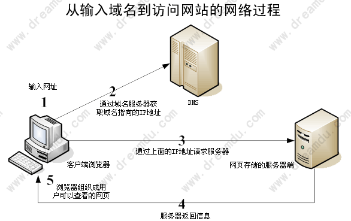

如何成为一个优秀的前端工程师
===
##【书写规范：】
>###单双引号：
>>【单引号】用在`javascript`中
>>【双引号】用在`HTML`中
>###变量命名
驼峰命名法（CamelCase）,首个单词的首字母小写，后面单词首字母大写。
>
	var resultArray，requestAnimationFrame;

>###常量命名
所有字母采用大写，多个单词用下划线隔开。
>
	var WIDTH=100，
	    BRUSH_COLOR='#00ff00';

>###jQuery类型变量
以$开头。很方便地将它与普通变量区别开来，一看到以$开头我们就知道它是jQuery类型可以直接在其身上调用jQuery相关的方法。
>
	var $element=$('a');

>###函数命名
驼峰命名法（CamelCase）,首个单词的首字母小写，后面单词首字母大写。
>>#####构造函数
首字符大写。
>>#####对象
驼峰命名法

##【文件规范：】

	APP
		-images     //图片文件夹
		-script     //js文件夹
			--js    //应用js common.js
			--jslib //引用js jQuery.js
		-style
			--css   //common.css
			--csslib //bootstrap.css
		-view
			--index.html

[从输入域名到访问网站的过程](http://www.dreamdu.com/webbuild/internet_process/)

[w3.org中国](http://www.chinaw3c.org/)

How to become a good web front-end engineer.

What makes a good front end engineer?

I’m not a engineer，I’m an artist.

[一名靠谱的JavaScript程序员应备的素质](http://ourjs.com/detail/52b0fb82d6feceaa0400000b)

[如何面试前端工程师：Github很重要](http://ourjs.com/detail/52c4145d7986593603000009)

[**前端知识体系及修炼攻略**](http://blog.csdn.net/borishuai/article/details/8676573)

[航旅无线前端团队必备技能](https://github.com/jayli/jayli.github.com/issues/16)

[Frontend Knowledge Structure](https://github.com/JacksonTian/fks)

[大牛朴灵](http://html5ify.com/)

[非编程天才参与开源项目的14种方式](http://www.php100.com/html/itnews/it/2012/0420/10275.html)

[世界前端大牛](http://news.cnblogs.com/n/500861/)

####HTML
#####标签
######块级元素Block-Level

######行级元素Inline-Level

+ Headings: h1, h2, h3, h4, h5, h6
+ Paragraphs: p
+ Text Formatting: em, strong, sub, del, ins, small
+ Lists: ul, li, ol, dl, dt, dd
+ Tables: table, thead, tbody, tr, th, td
+ Forms and Input: form, input, select, textarea
+ Others: div, span, a, img, <!---->
+ HTML5: header, footer, article, section

####CSS

####JAVSCRIPT

####工具
[在线编程runjs](http://runjs.cn/)

[在线编程jsfiddle](http://jsfiddle.net/)

[prefixMyCSS](http://prefixmycss.com/)

1. DOM结构——两个节点之间可能存在哪些关系以及如何在节点之间任意移动。
1. DOM操作——怎样添加、移除、移动、复制、创建和查找节点。
1. 事件——怎样使用事件以及IE和DOM事件模型之间存在哪些主要差别。
1. XMLHttpRequest——这是什么、怎样完整地执行一次GET请求、怎样检测错误。
严格模式与混杂模式——如何触发这两种模式，区分它们有何意义。
1. 盒模型——外边距、内边距和边框之间的关系，IE < 8中的盒模型有什么不同。
块级元素与行内元素——怎么用CSS控制它们、它们怎样影响周围的元素以及你觉得应该如何定义它们的样式。
1. 浮动元素——怎么使用它们、它们有什么问题以及怎么解决这些问题。
1. HTML与XHTML——二者有什么区别，你觉得应该使用哪一个并说出理由。
1. JSON——它是什么、为什么应该使用它、到底该怎么使用它，说出实现细节来。