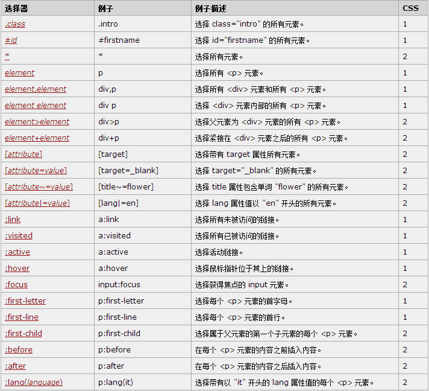
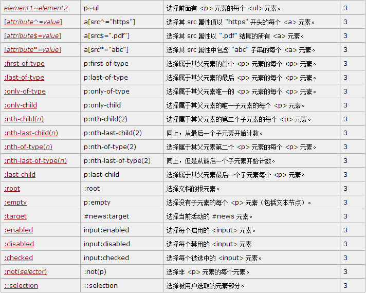
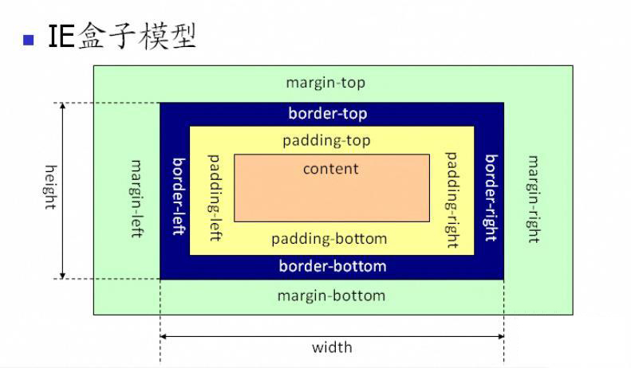

#CSS层叠样式表
>
[1. CSS基础知识](#jichu)
>>
[选择器](#select)
[优先级](#youxianji)
[层叠和继承](#cengdie)
[CSS字体](#ziti)
[盒模型](#hezi)
[定位](#dingwei)
[浮动](#fudong)
>
[2. CSS进阶](#jingjie)
>>
[CSS Sprite](#sprite)
[浏览器兼容性](#jianrong)
[IE HasLayout和Block Format Content](#ie)
[CSS Frameworks](#frameworks)
[CSS3](#css3)
[CSS性能优化](#xingneng)
[LESS and SASS](#less)

##[【选择器】](http://www.w3school.com.cn/cssref/css_selectors.asp)

##CSS优先级
####加载：	
		行内式样式(Inline Style) 
		> 嵌入式样式表（Embedded Style Sheets）
		> 外部样式表（Link Style Sheets）
####覆盖： 
	!important 					(1000)
	> 
	id选择器指定的样式 			（100）
	> 
	类选择器指定的样式 			（10）
	> 
	元素类型选择器指定的样式	（1）
	>
	*							

##[【css层级关系，嵌套关系】](http://www.cnblogs.com/cs_net/articles/1930810.html)

计算如下：

	div p { color: red; }
	p { color: blue; }
>
p的特性是     1（一个html选择器）
	div p的特性是 2（两个html选择器）
	.tree的特性是 10（1个class选择器）
	div p.tree的特性是  1+1+10=12，（两个html选择器，一个class选择器）
	#baobab的特性是     100（1个ID选择器）
	body #content .alternative p的特性是 112（两个html选择器，一个ID选择器，一个类选择器）
	按照上面的规则，div p.tree的特性比div p高，body #content .alternative p又比它们两个都高。

###CSS字体 font-family: 华文细黑

<table class="jbborder">
    <thead>
        <tr>
            <th>中文名</th>
            <th>英文名</th>
            <th>Unicode</th>
            <th>Unicode 2</th>
        </tr>
        <tr>
            <th colspan="4">Mac OS</th>
        </tr>
    </thead>
    <tbody>
        <tr style="FONT-FAMILY: 华文细黑">
            <td>华文细黑</td>
            <td>STHeiti Light [STXihei]</td>
            <td>\534E\6587\7EC6\9ED1</td>
            <td>华文细黑</td>
        </tr>
        <tr style="FONT-FAMILY: 华文黑体">
            <td>华文黑体</td>
            <td>STHeiti</td>
            <td>\534E\6587\9ED1\4F53</td>
            <td>华文黑体</td>
        </tr>
        <tr style="FONT-FAMILY: 华文楷体">
            <td>华文楷体</td>
            <td>STKaiti</td>
            <td>\534E\6587\6977\4F53</td>
            <td>华文楷体</td>
        </tr>
        <tr style="FONT-FAMILY: 华文宋体">
            <td>华文宋体</td>
            <td>STSong</td>
            <td>\534E\6587\5B8B\4F53</td>
            <td>华文宋体</td>
        </tr>
        <tr style="FONT-FAMILY: 华文仿宋">
            <td>华文仿宋</td>
            <td>STFangsong</td>
            <td>\534E\6587\4EFF\5B8B</td>
            <td>华文仿宋</td>
        </tr>
        <tr style="FONT-FAMILY: 丽黑pro">
            <td>丽黑 Pro</td>
            <td>LiHei Pro Medium</td>
            <td>\4E3D\9ED1 Pro</td>
            <td>丽黑 Pro</td>
        </tr>
        <tr style="FONT-FAMILY: 丽宋pro">
            <td>丽宋 Pro</td>
            <td>LiSong Pro Light</td>
            <td>\4E3D\5B8B Pro</td>
            <td>丽宋 Pro</td>
        </tr>
        <tr style="FONT-FAMILY: 标楷体">
            <td>标楷体</td>
            <td>BiauKai</td>
            <td>\6807\6977\4F53</td>
            <td>标楷体</td>
        </tr>
        <tr style="FONT-FAMILY: 苹果丽中黑">
            <td>苹果丽中黑</td>
            <td>Apple LiGothic Medium</td>
            <td>\82F9\679C\4E3D\4E2D\9ED1</td>
            <td>苹果丽中黑</td>
        </tr>
        <tr style="FONT-FAMILY: ">
            <td>苹果丽细宋</td>
            <td>Apple LiSung Light</td>
            <td>\82F9\679C\4E3D\7EC6\5B8B</td>
            <td>苹果丽细宋</td>
        </tr>
    </tbody>
    <thead>
        <tr>
            <th colspan="4">Windows</th>
        </tr>
    </thead>
    <tbody>
        <tr style="FONT-FAMILY: 新细明体">
            <td>新细明体</td>
            <td>PMingLiU</td>
            <td>\65B0\7EC6\660E\4F53</td>
            <td>新细明体</td>
        </tr>
        <tr style="FONT-FAMILY: 细明体">
            <td>细明体</td>
            <td>MingLiU</td>
            <td>\7EC6\660E\4F53</td>
            <td>细明体</td>
        </tr>
        <tr style="FONT-FAMILY: 标楷体">
            <td>标楷体</td>
            <td>DFKai-SB</td>
            <td>\6807\6977\4F53</td>
            <td>标楷体</td>
        </tr>
        <tr style="FONT-FAMILY: 黑体">
            <td>黑体</td>
            <td>SimHei</td>
            <td>\9ED1\4F53</td>
            <td>黑体</td>
        </tr>
        <tr style="FONT-FAMILY: 宋体">
            <td>宋体</td>
            <td>SimSun</td>
            <td>\5B8B\4F53</td>
            <td>宋体</td>
        </tr>
        <tr style="FONT-FAMILY: 新宋体">
            <td>新宋体</td>
            <td>NSimSun</td>
            <td>\65B0\5B8B\4F53</td>
            <td>新宋体</td>
        </tr>
        <tr style="FONT-FAMILY: 仿宋">
            <td>仿宋</td>
            <td>FangSong</td>
            <td>\4EFF\5B8B</td>
            <td>仿宋</td>
        </tr>
        <tr style="FONT-FAMILY: 楷体">
            <td>楷体</td>
            <td>KaiTi</td>
            <td>\6977\4F53</td>
            <td>楷体</td>
        </tr>
        <tr style="FONT-FAMILY: 仿宋_gb2312">
            <td>仿宋_GB2312</td>
            <td>FangSong_GB2312</td>
            <td>\4EFF\5B8B_GB2312</td>
            <td>仿宋_GB2312</td>
        </tr>
        <tr style="FONT-FAMILY: 楷体_gb2312">
            <td>楷体_GB2312</td>
            <td>KaiTi_GB2312</td>
            <td>\6977\4F53_GB2312</td>
            <td>楷体_GB2312</td>
        </tr>
        <tr style="FONT-FAMILY: 微x8f6f正黑体">
            <td>微软正黑体</td>
            <td>Microsoft JhengHei</td>
            <td>\5FAE\x8F6F\6B63\9ED1\4F53</td>
            <td>微软正黑体</td>
        </tr>
        <tr style="FONT-FAMILY: 微软雅黑">
            <td>微软雅黑</td>
            <td>Microsoft YaHei</td>
            <td>\5FAE\8F6F\96C5\9ED1</td>
            <td>微软雅黑</td>
        </tr>
    </tbody>
    <thead>
        <tr>
            <th colspan="4">Office</th>
        </tr>
    </thead>
    <tbody>
        <tr style="FONT-FAMILY: 隶书">
            <td>隶书</td>
            <td>LiSu</td>
            <td>\96B6\4E66</td>
            <td>隶书</td>
        </tr>
        <tr style="FONT-FAMILY: 幼圆">
            <td>幼圆</td>
            <td>YouYuan</td>
            <td>\5E7C\5706</td>
            <td>幼圆</td>
        </tr>
        <tr style="FONT-FAMILY: 华文细黑">
            <td>华文细黑</td>
            <td>STXihei</td>
            <td>\534E\6587\7EC6\9ED1</td>
            <td>华文细黑</td>
        </tr>
        <tr style="FONT-FAMILY: 华文楷体">
            <td>华文楷体</td>
            <td>STKaiti</td>
            <td>\534E\6587\6977\4F53</td>
            <td>华文楷体</td>
        </tr>
        <tr style="FONT-FAMILY: 华文宋体">
            <td>华文宋体</td>
            <td>STSong</td>
            <td>\534E\6587\5B8B\4F53</td>
            <td>华文宋体</td>
        </tr>
        <tr style="FONT-FAMILY: 华文中宋">
            <td>华文中宋</td>
            <td>STZhongsong</td>
            <td>\534E\6587\4E2D\5B8B</td>
            <td>华文中宋</td>
        </tr>
        <tr style="FONT-FAMILY: 华文仿宋">
            <td>华文仿宋</td>
            <td>STFangsong</td>
            <td>\534E\6587\4EFF\5B8B</td>
            <td>华文仿宋</td>
        </tr>
        <tr style="FONT-FAMILY: 方正舒体">
            <td>方正舒体</td>
            <td>FZShuTi</td>
            <td>\65B9\6B63\8212\4F53</td>
            <td>方正舒体</td>
        </tr>
        <tr style="FONT-FAMILY: 方正姚体">
            <td>方正姚体</td>
            <td>FZYaoti</td>
            <td>\65B9\6B63\59DA\4F53</td>
            <td>方正姚体</td>
        </tr>
        <tr style="FONT-FAMILY: 华文彩云">
            <td>华文彩云</td>
            <td>STCaiyun</td>
            <td>\534E\6587\5F69\4E91</td>
            <td>华文彩云</td>
        </tr>
        <tr style="FONT-FAMILY: 华文琥珀">
            <td>华文琥珀</td>
            <td>STHupo</td>
            <td>\534E\6587\7425\73C0</td>
            <td>华文琥珀</td>
        </tr>
        <tr style="FONT-FAMILY: 华文隶书">
            <td>华文隶书</td>
            <td>STLiti</td>
            <td>\534E\6587\96B6\4E66</td>
            <td>华文隶书</td>
        </tr>
        <tr style="FONT-FAMILY: 华文行楷">
            <td>华文行楷</td>
            <td>STXingkai</td>
            <td>\534E\6587\884C\6977</td>
            <td>华文行楷</td>
        </tr>
        <tr style="FONT-FAMILY: 华文新魏">
            <td>华文新魏</td>
            <td>STXinwei</td>
            <td>\534E\6587\65B0\9B4F</td>
            <td>华文新魏</td>
        </tr>
    </tbody>
</table>

那应该选择哪中盒子模型呢？ 
当然是“标准 W3C 盒子模型”了。

怎么样才算是选择了“标准 W3C 盒子模型”呢？ 
很简单，就是在网页的顶部加上 DOCTYPE 声明。如果不加 DOCTYPE 声明，那么各个浏览器会根据自己的行为去理解网页，即 IE 浏览器会采用 IE 盒子模型去解释你的盒子，而 FF 会采用标准 W3C 盒子模型解释你的盒子，所以网页在不同的浏览器中就显示的不一样了。反之，如果加上了 DOCTYPE 声明，那么所有浏览器都会采用标准 W3C 盒子模型去解释你的盒子，网页就能在各个浏览器中显示一致了。

CSS定位position

	static
元素框正常生成。块级元素生成一个矩形框，作为文档流的一部分，行内元素则会创建一个或多个行框，置于其父元素中。

	relative
元素框偏移某个距离。元素仍保持其未定位前的形状，它原本所占的空间仍保留。

	absolute
元素框从文档流完全删除，并相对于其包含块定位。包含块可能是文档中的另一个元素或者是初始包含块。元素原先在正常文档流中所占的空间会关闭，就好像元素原来不存在一样。元素定位后生成一个块级框，而不论原来它在正常流中生成何种类型的框。

	fixed
元素框的表现类似于将 position 设置为 absolute，不过其包含块是视窗本身。

##css进阶

###CSS Sprite
CSS Sprite主要用于前端性能优化的一种技术，原理是通过将多张背景图片合成在一张图片上从而**减少HTTP请求**，加快载入速度。

CSS Sprites在开发的时候比较麻烦，你要通过photoshop或其他工具测量计算每一个背景单元的精确位置，这是针线活。

*CSS Sprites样式生成工具*

####背景图片

	background: #ff0000 url(url) no-repeat  fixed 100px 50px;

	background-color: #ff0000;	//css1
	background-image: url(url);	//1
	background-repeat: no-repeat; //1
	background-position: 100px 100px;  //1

	background-size	规定背景图片的尺寸。	3
	background-origin	规定背景图片的定位区域。	3
	background-clip	规定背景的绘制区域。	3
	background-attachment	规定背景图像是否固定或者随着页面的其余部分滚动。	1
	inherit										1

###浏览器兼容性
>
Mozilla Firefox ( Gecko )
Internet Explorer ( Trident )
Opera ( Presto )
Safari ( WebKit )
Google Chrome ( WebKit )
国内浏览器（腾讯TT、世界之窗、360浏览器、遨游浏览器 都是给IE或者chrome加了个外壳）

###CSS3

+ 圆角
+ 多背景
+ @font-face
+ 动画与渐变
+ 渐变色
+ Box阴影
+ RGBa-加入透明色
+ 文字阴影

#css兼容.md
##css兼容问题原因 

###浏览器内核不同
> > >
	Mozilla Firefox ( Gecko )
	Internet Explorer ( Trident )
	Opera ( Presto )
	Safari ( WebKit )
	Google Chrome ( WebKit )
	国内浏览器（腾讯TT、世界之窗、360浏览器、遨游浏览器 都是给IE或者chrome加了个外壳）

###DOCTYPE解析不同

> ###CSS规则
> > ####1、默认样式不同
> > > 
	html
	body
	form
	margin
	padding
	行高

> > ####2、块级元素和行级元素

> > ####3、盒子模型

> > ####4、透明/遮罩

> > ####5、不同的元素
> > >
	（1）IE不认min-height,min-width
	（2）curser:hand;只有IE认，用curser:pointer;
	（3）属性选择器
	（4） ime-mode设置输入法chrome不可用

5、float
float闭合:
6、position

万恶的IE

单选复选框前面与文字不对齐

&nbsp; 显示的大小不一致

!important（顺序）
1、只有IE6不识别，用来做IE6方面兼容比较好。
2、用来覆盖样式。