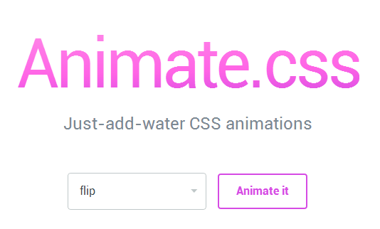

[w3school](http://www.w3school.com.cn/) 
[百度CDN](http://cdn.code.baidu.com/)
Javascript
===
[jquery API](http://jquery.bootcss.com/)

[zeptojs](http://zeptojs.com/) [zepto.js教程中文版](http://www.css88.com/doc/zeptojs_api/)

[bootcss 3](http://v3.bootcss.com/)
CSS
===
###网络资源
动画制作
---

[教程01](http://ourjs.com/detail/animate-css%E8%AE%A9%E6%B7%BB%E5%8A%A0css%E5%8A%A8%E7%94%BB%E5%83%8F%E5%96%9D%E6%B0%B4%E4%B8%80%E6%A0%B7%E5%AE%B9%E6%98%93)

###本地资源

HTML
===

框架
===

前端工程师联盟
===
[http://wangyuanwai.com/](http://wangyuanwai.com/)

内容居中

position定位